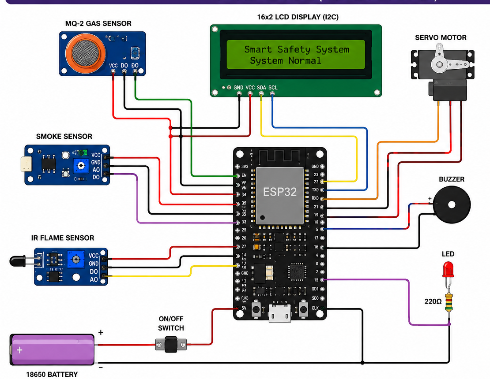
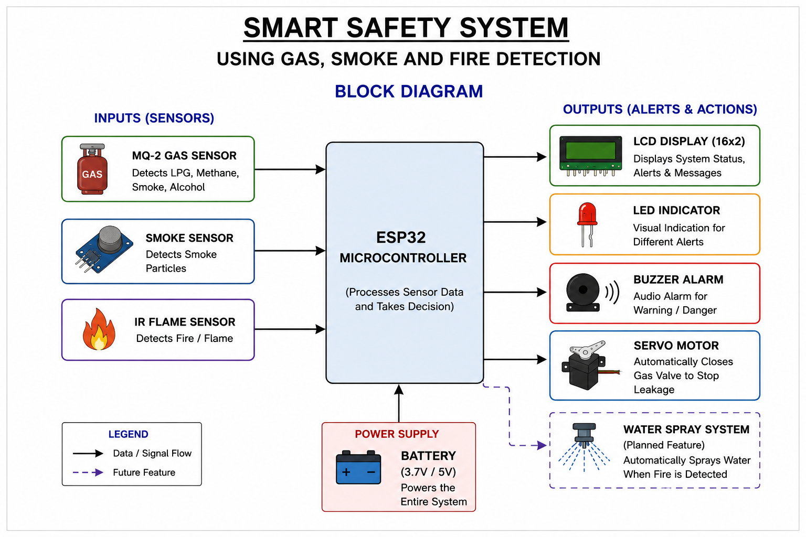
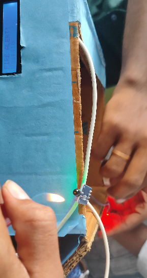
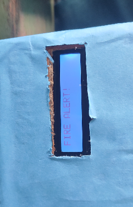
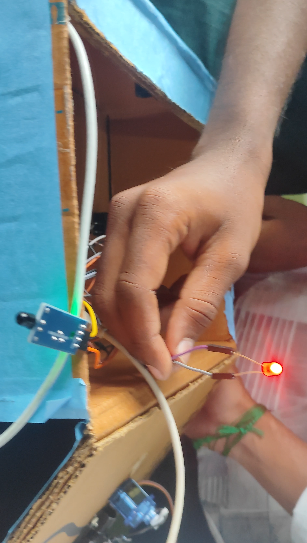

&#x20;             Smart Safety System Using Gas, Smoke and Fire Detection Using Embedded System

Project Overview:

The \*\*Smart Safety System\*\* is an embedded systems project designed to improve safety by detecting hazardous conditions such as gas leakage, smoke, and fire. The system continuously monitors the environment using multiple sensors and provides immediate alerts whenever a dangerous situation is detected.

When a gas leak is detected, the system activates a buzzer and LED to alert nearby people while displaying a warning message on the LCD display. At the same time, a servo motor automatically closes the gas valve to help stop further gas leakage and reduce the risk of accidents.

The system is also capable of detecting smoke and fire. A future enhancement planned for this project is an automatic water spraying mechanism that activates when a fire is detected. Although this feature was designed and planned, it could not be implemented within the current project timeline.

Features:

\* Real-time gas leakage detection.

\* Smoke detection for early warning.

\* Fire detection for improved safety.

\* Automatic gas valve closure using a servo motor.

\* Visual warning using an LED.

\* Audible alert using a buzzer.

\* LCD display to show system status and alert messages.

\* Low-cost and energy-efficient embedded system.

\* Modular design that allows future upgrades.

\* Suitable for homes, kitchens, laboratories, and small industries.

&#x20;Components Used:

\* ESP32 Development Board

\* MQ-2 Gas Sensor

\* Smoke Sensor

\* IR Sensor (Fire Detection)

\* Servo Motor

\* LCD Display

\* Buzzer

\* LED

\* Battery

\* Jumper Wires

\* Breadboard

Working Principle:

1\. The ESP32 continuously reads data from the gas, smoke, and fire sensors.

2\. If gas leakage is detected, the system:

&#x20;  \* Activates the buzzer.

&#x20;  \* Turns on the LED.

&#x20;  \* Displays a warning message on the LCD.

&#x20;  \* Rotates the servo motor to close the gas valve automatically.

3\. If smoke is detected, the system immediately alerts the user through the buzzer, LED, and LCD display.

4\. If fire is detected, the system generates an alert. The proposed enhancement is to automatically activate a water spraying mechanism to suppress the fire.

5\. The system continuously monitors the environment to provide uninterrupted safety.

Applications:

\* Residential Homes

\* Kitchens

\* LPG Storage Areas

\* Laboratories

\* Small Industries

\* Commercial Buildings

Advantages:

\* Early detection of gas leakage, smoke, and fire.

\* Automatic prevention of gas leakage using a servo motor.

\* Reduces the possibility of accidents and property damage.

\* Fast response to emergency situations.

\* Compact and cost-effective design.

\* Easy to install and maintain.

\* Expandable for future IoT and smart home applications.

&#x20;Future Enhancements:

\* Automatic water spraying system during fire incidents.

\* GSM or Wi-Fi notifications to send alerts to users' mobile phones.

\* Mobile application for remote monitoring.

\* Cloud-based data logging and analysis.

\* Emergency call or SMS notification system.

\* Battery backup monitoring and power management.

Project Outcome:

This project demonstrates how embedded systems can be used to improve safety by combining sensing, monitoring, and automatic control. By integrating multiple sensors with the ESP32, the system provides quick detection of hazardous situations and performs immediate preventive actions, making it a practical solution for enhancing safety in homes and workplaces.

\---

Author:

Vikas ks
B.E. Electronics and Communication Engineering (ECE)

## Project Images

### Circuit Diagram

### Block Diagram

### Fire Detection

### Fire Alert Display

### LED and Buzzer

---

## Demonstration

The project demonstrates the following functionalities:

- Gas leakage detection using the MQ-2 sensor.
- Smoke detection for early warning.
- Fire detection using the flame sensor.
- Automatic gas valve shutdown using a servo motor.
- LCD displays real-time system status and warning messages.
- LED and buzzer provide immediate alerts during emergencies.

The repository also includes a demonstration video:

- smoke_and_gas_detection.mp4

---

## Future Enhancements

- Automatic water spraying mechanism for fire suppression.
- IoT-based mobile notifications using ESP32 Wi-Fi.
- Cloud-based monitoring and event logging.
- Mobile application for remote monitoring.

